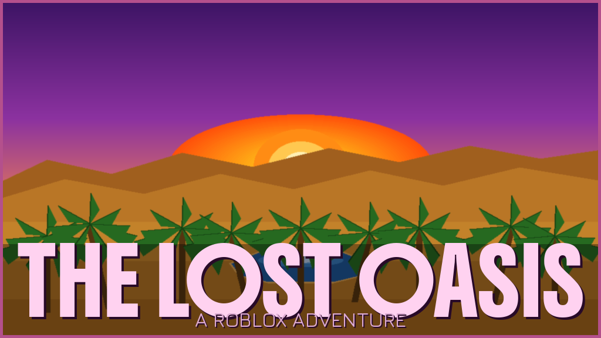
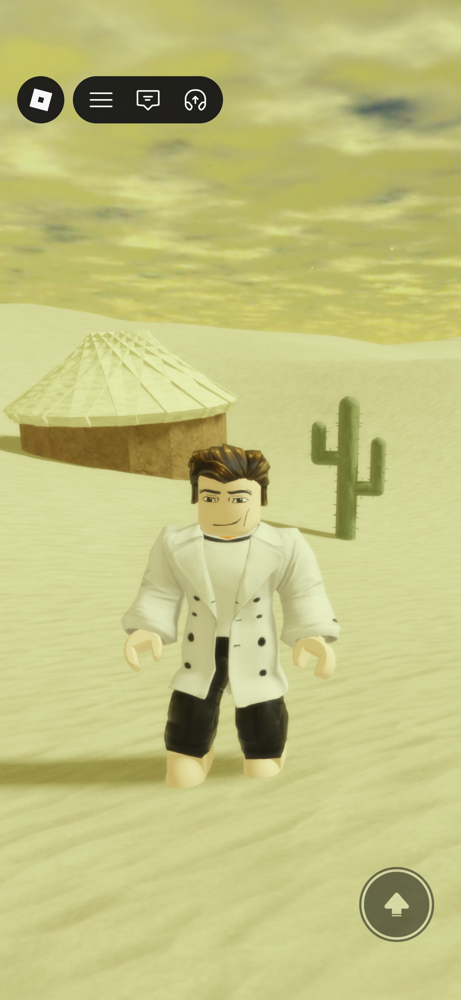
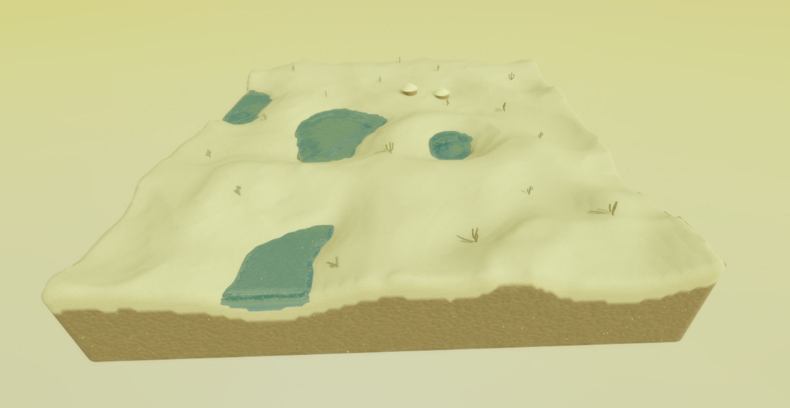
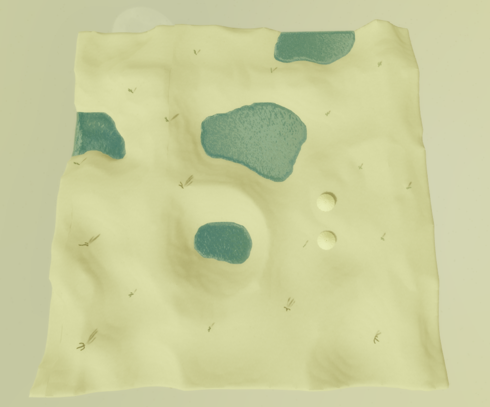

# 🏜️ The Lost Oasis



> A vast desert exploration experience built in Roblox Studio; discover ancient oases, roam endless sand dunes, and uncover the secrets of a lost world.

---

## 🎮 Play the Game

🔗 [Play on Roblox](https://www.roblox.com/games/YOUR_GAME_ID)

---

## 📸 Screenshots

| Gameplay | Oasis |
|----------|-------|
|  |  |

**Mobile:**



---

## 🗺️ Map Overview

| Isometric View | Top View |
|----------------|----------|
|  |  |

---

## ✨ Features

- 🌵 **Fully sculpted desert terrain** — procedurally generated sand dunes using Roblox's Terrain Editor
- 💧 **Oasis water pools** — scattered naturally across the desert landscape
- 🏚️ **Desert hut structures** — explorable buildings placed throughout the world
- 🎵 **Epic adventure music** — looping Arabian-style background soundtrack
- 📱 **Cross-platform** — fully playable on both PC and mobile devices
- ☀️ **Immersive atmosphere** — dynamic lighting and fog for a realistic desert feel

---

## 🛠️ Built With

| Tool | Purpose |
|------|---------|
| **Roblox Studio** | Game development environment |
| **Roblox Terrain Editor** | Desert terrain sculpting and painting |
| **Lua scripting** | Spawn logic and game mechanics |
| **Roblox Toolbox** | Desert hut and cactus assets |

---

## 🧱 Development Highlights

- Used the **Terrain Editor's Sea Level tool** to place oasis water pools naturally within desert depressions
- Solved a **mobile spawning bug** by fine-tuning SpawnLocation Y-position to align with terrain surface
- Implemented a **Lua respawn script** to handle terrain loading differences between PC and mobile
- Designed custom **game icon and thumbnail** assets at 512×512 and 1024×576 resolutions

---

## 📁 Project Structure

```
The Lost Oasis (Roblox Studio)
├── Workspace
│   ├── Terrain          # Desert biome with sand material
│   ├── SpawnLocation    # Player spawn point
│   ├── Cactus (x20)    # Desert cactus models
│   ├── Hut (x2)        # Explorable desert structures
│   └── Parts            # Water/oasis elements
├── ServerScriptService
│   └── Script           # Spawn and game logic
└── SoundService
    └── Sound            # Looping background music
```

---

## 👨‍💻 Developer

**Rayane** — [@rayane_drh1](https://www.roblox.com/users/YOUR_USER_ID/profile)

Junior Computer Science student at Alma College  
Built as part of **CSC-355: Game Engine Fundamentals**

---

## 📄 License

This project was built for educational purposes as part of a university course.  
All Roblox assets used are sourced from the official Roblox Toolbox.
